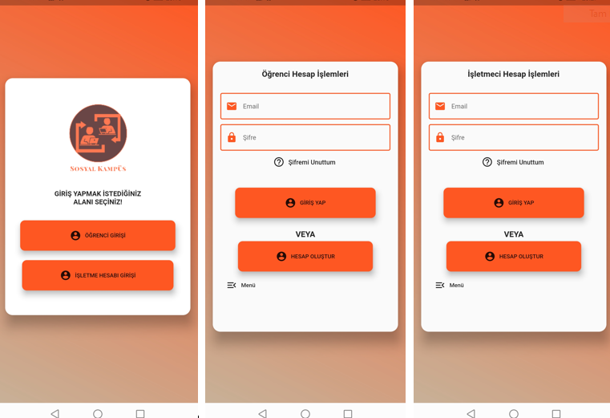
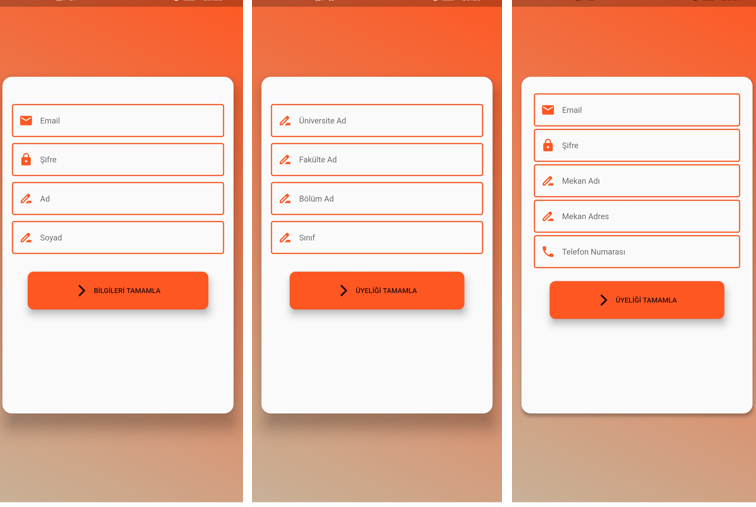
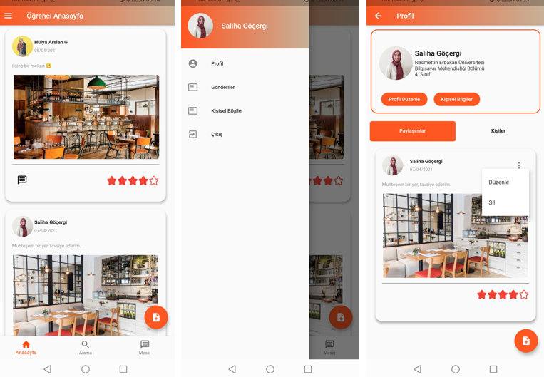
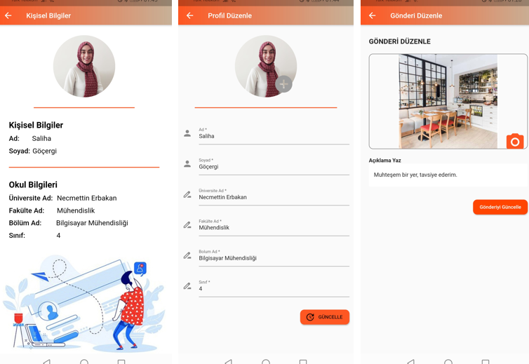
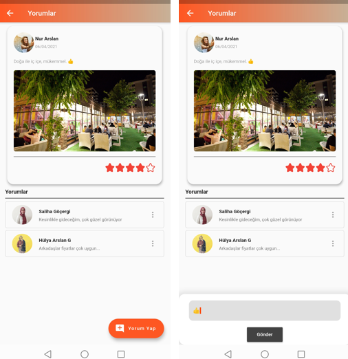
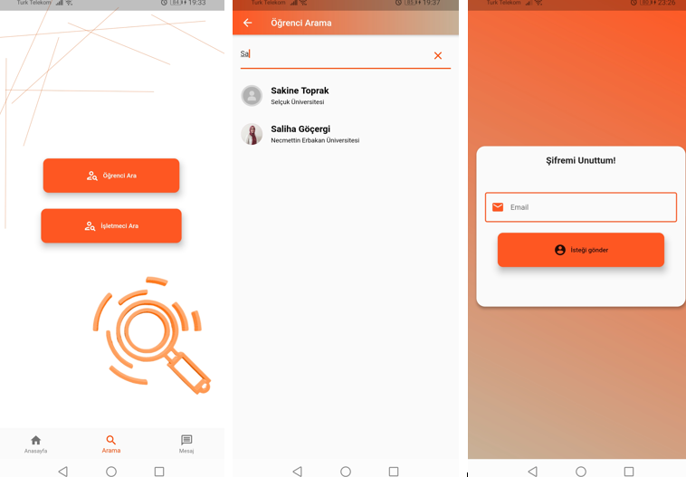

## sosyal_kampus_uygulamasi
Flutter üzerinde ve Firebase veritabanı kullanılarak oluşturulmuş bir sosyal medya platformudur.
*Sosyal Kampüs projesi, öğrencilerin birbirleriyle ve kampüsle internet üzerinden etkileşim halinde olabilmeleri için kullanabilecekleri bir mobil uygulamadır.
Kampüste mekân işleten kişilerden, etkinlik düzenleyen kişilere kadar, kampüs hayatındaki herkesin kullanabileceği Sosyal Kampüs uygulaması,
bu kişilerin birbirleri ile internet üzerinden etkileşim halinde olabilmesini sağlayacaktır.*  
*Bu uygulamada 2 giriş(Öğrenci girişi ve İşletme girişi) yapılabilir. Üniversitemizin öğrencilerinin kolay bir şekilde birbirleriyle iletişime geçebilecekleri,
İl düzeyinde yapılan etkinliklerden anlık haberdar olmasını sağlayacaktır.*  

**Aşağıda uygulamanın ekran görüntüleri mevcuttur.** 
*İlk resimde Uygulamanın ana ekranı, ardından Öğrenci ve İşletmeci Giriş Ekranı bulunmaktadır.* 
 
*İlk 2 ekran Öğrenci yeni hesap oluşturma ekranlarıdır. 3. ekran ise İşletmeci yeni hesap oluşturma ekranıdır.* 
 
*Aşağıda Öğrenci ana sayfası, ana ekranın yan menüsü ve profil ekranları vardır.*  
 
*Öğrenci Kişisel Bilgiler sayfası, Profil ve Gönderi Düzenleme sayfaları mevcuttur.* 
 
*Gönderilerimiz bir başka kullanıcının ana sayfasına düşmekte ve gönderinin altına yorum yapılabilmektedir. Aşağıda yorum ekranları görüntüleri mevcut.* 
 
*Uygulamada bulmak istenilen kişileri arama özelliği sayesinde bulabilirsiniz. ilk 2 resim arama ekranlarıdır. 3.resim ise şifremizi unuttuğumuz takdirde şifre yenileme yapılabilmektedir.* 
 
